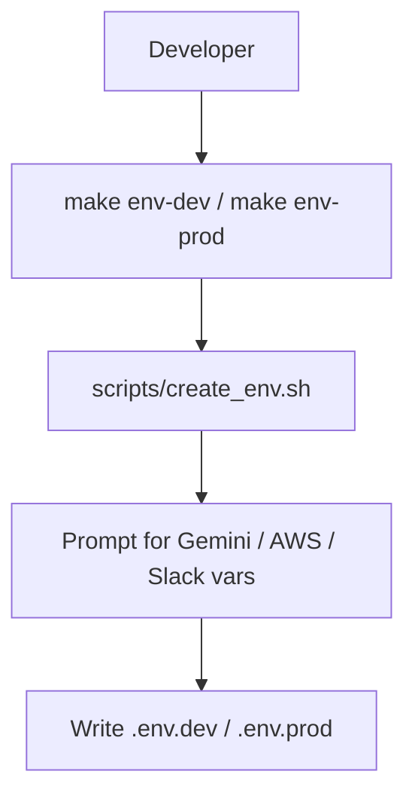
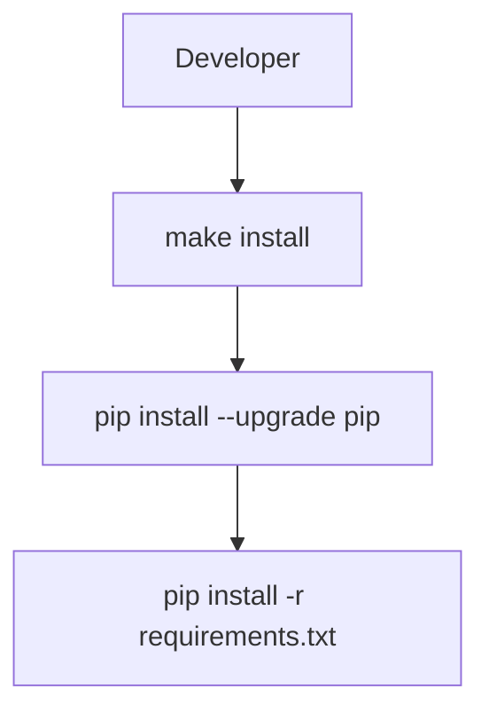
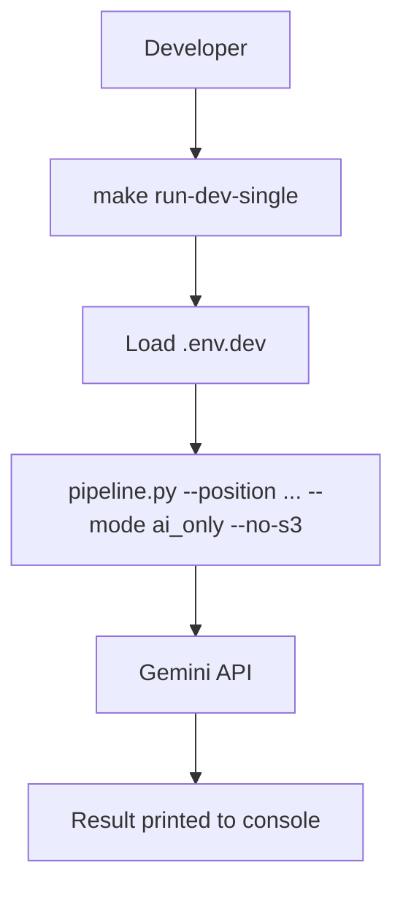
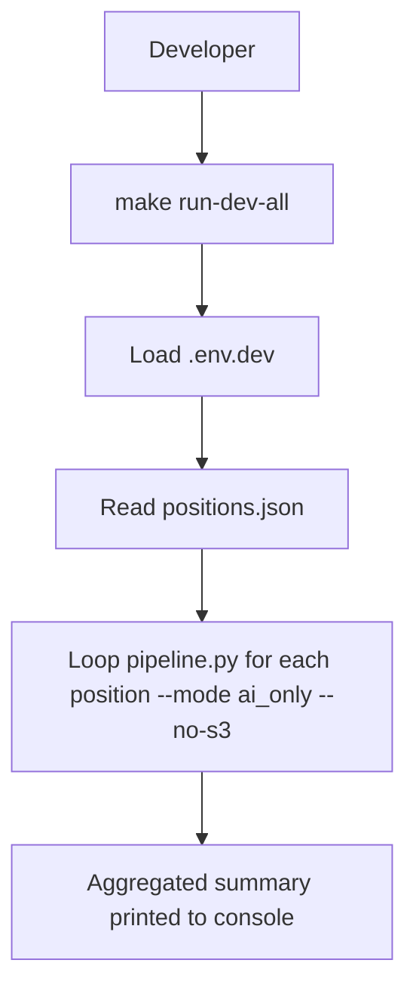
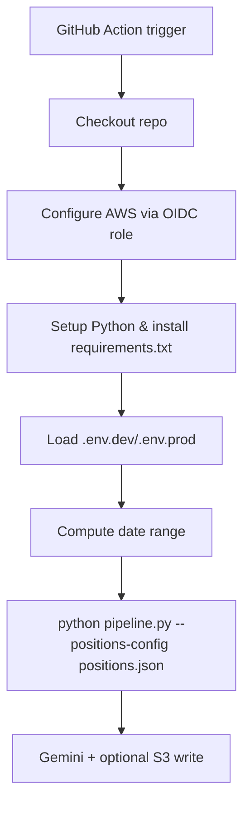

## LATAM roles data pipeline

This project provides a **data pipeline** that:

- **Uses Gemini** to estimate how many job positions exist for given roles in **LATAM** for a period.
- Can optionally **ground the estimates** using Google Custom Search (mode `search`), though the default is **AI-only** (mode `ai_only`).
- Stores results as JSON (optionally in **S3**) for further analytics.

### 1. Setup

1. Create and activate a Python virtual environment (optional but recommended).
2. Install dependencies:

```bash
pip install -r requirements.txt
```

3. Configure environment variables (for example in `.env.dev` or your shell):

- `GEMINI_API_KEY`: API key for the Gemini API (via Google AI Studio / Google Generative AI).
- `OUTPUT_BUCKET` (optional): S3 bucket to store JSON results.

If you later want to use Google Custom Search (`mode=search`), also set:

- `GOOGLE_CSE_API_KEY`: API key for Google Programmable Search (Custom Search JSON API).
- `GOOGLE_CSE_ID`: Your Custom Search Engine ID (cx).

`.env` files are generated interactively with the Makefile (see below).

### 2. Core pipeline behavior

The `pipeline.py` script:

1. Receives **position(s)** and a **start/end date**.
2. In **AI-only mode** (`mode="ai_only"`, default):
   - Asks Gemini to estimate:
     - `total_positions`: approximate number of open roles.
     - `keywords`: approximate counts of key tools/skills across those roles  
       (e.g. `{"python": 362, "snowflake": 36, "terraform": 56}`).
3. In **search mode** (`mode="search"`, optional):
   - Builds a Google query.
   - Calls Google Custom Search API to get organic search results.
   - Asks Gemini to extract and count real postings from those results.
4. Optionally writes each result to **S3** as JSON, using an S3 key pattern:
   - `roles/<position_id>/<run_date>_<start_date>_to_<end_date>.json`.

### 3. Make targets and local flows

#### 3.1 Environment creation (`env-dev` / `env-prod`)



#### 3.2 Local install (`install`)



#### 3.3 Local single-position run (`run-dev-single`)



#### 3.4 Local multi-position run (`run-dev-all`)



#### 3.5 Terraform helpers (`terraform-*`)

```mermaid
flowchart TD
  A[Developer] --> B[make terraform-init-dev/prod]
  B --> C[bootstrap-tf-state (create tf state S3 bucket via AWS CLI)]
  C --> D[terraform init with S3 backend]
  A --> D[make terraform-apply-dev/prod]
  D --> E[terraform apply -var environment=dev/prod -var-file=*.tfvars]
  E --> F[AWS S3 results bucket + Glue DB/table + IAM role for GitHub]
```

### 4. Usage examples

#### 4.1 Direct CLI (AI-only, single position)

```bash
python pipeline.py \
  --position "Data Engineer" \
  --start-date 2025-01-01 \
  --end-date 2025-01-31 \
  --mode ai_only \
  --no-s3
```

#### 4.2 Direct CLI (AI-only, all positions from `positions.json`)

```bash
python pipeline.py \
  --start-date 2025-01-01 \
  --end-date 2025-01-31 \
  --positions-config positions.json \
  --mode ai_only \
  --no-s3
```

### 5. Airflow orchestration

- DAG: `airflow/dags/latam_roles_pipeline_dag.py`.
- Schedule: monthly (`0 3 1 * *`), or manual runs with `dag_run.conf.start_date` / `end_date`.
- Flow:

```mermaid
flowchart TD
  A[Airflow scheduler] --> B[latam_roles_pipeline DAG]
  B --> C[run_latam_roles_pipeline task]
  C --> D[Read positions.json]
  D --> E[For each position: run_pipeline(...)]
  E --> F[Gemini AI-only estimate or search+Gemini]
  F --> G[Optional S3 write]
  C --> H[XCom results_summary]
  H --> I[slack_success_notification]
  I --> J[Slack channel]
```

### 6. GitHub Actions (optional)

- Workflow: `.github/workflows/latam-roles-pipeline.yml`.
- Triggers:
  - `workflow_dispatch` with inputs `environment`, `start_date`, `end_date`.
  - Monthly `schedule` (cron) using previous full month if dates not provided.



### 7. Using from Python

You can also import and call the pipeline from other Python code:

```python
from pipeline import run_pipeline

result = run_pipeline(
    position="Data Engineer",
    start_date="2025-01-01",
    end_date="2025-01-31",
    mode="ai_only",
)
print(result["total_positions"])
```

### 8. Notes

- **Modes**:
  - **`ai_only`** (default): Gemini-only estimates, no external search.
  - **`search`**: Google Custom Search + Gemini extraction (requires CSE keys).
- S3 writes are controlled via `OUTPUT_BUCKET` and the `--no-s3` flag.
- The JSON shape in S3 is designed to be easy to query later with Athena/Glue/Redshift.

### 9. AWS deployment (Terraform + S3 + Glue + Athena)

#### 9.1 Prerequisites

- **AWS CLI** installed and configured locally:

```bash
aws configure
```

Make sure you set:

- `AWS_ACCESS_KEY_ID`, `AWS_SECRET_ACCESS_KEY`
- `AWS_DEFAULT_REGION` (e.g. `us-east-1`)

#### 9.2 What Terraform creates

In `infra/terraform` the Terraform stack defines:

- **Terraform state bucket** (created automatically via Makefile script):
  - `latam-roles-tf-state` in `us-east-1` (used only for Terraform state).
- **Results S3 bucket** (per environment):
  - `latam-roles-results-dev`
  - `latam-roles-results-prod` (when you apply for `prod`)
  - Used by `pipeline.py` when `OUTPUT_BUCKET` is set.
- **Glue Data Catalog**:
  - Database: `latam-roles_<env>_db` (e.g. `latam-roles_dev_db`).
  - External table: `latam_roles_ai_estimates` pointing at `s3://latam-roles-results-<env>/roles/`.
- **IAM for GitHub Actions**:
  - GitHub OIDC provider.
  - IAM role `latam-roles-gha-<env>` with S3 permissions for the results bucket.

#### 9.3 Deploying to AWS (dev)

From the project root, with AWS CLI configured:

```bash
# Initialize backend + providers, and auto-create tf state bucket if needed
make terraform-init-dev

# Create S3 results bucket, Glue DB/table, IAM role, etc.
make terraform-apply-dev
```

After `terraform apply`, you can see outputs by running:

```bash
cd infra/terraform
terraform output
```

You should see:

- `results_bucket_name` (use this as `OUTPUT_BUCKET` in `.env.dev`).
- `glue_database_name` / `glue_table_name` (use them in Athena).
- `github_actions_role_arn` (set as `AWS_GITHUB_ROLE_ARN` in GitHub secrets).

### 10. Database / analytics structure

#### 10.1 S3 layout

- Bucket per environment:
  - `latam-roles-results-dev`
  - `latam-roles-results-prod`
- Object key pattern per role+run:
  - `roles/<position_id>/<run_date>_<start_date>_to_<end_date>.json`

Example:

```text
roles/data_engineer/2026-03-07_2025-01-01_to_2025-01-31.json
```

Each JSON file (one per position per run) looks like:

```json
{
  "total_positions": 9500,
  "keywords": {
    "SQL": 8835,
    "Python": 8265,
    "AWS": 5510,
    "Terraform": 1995
  },
  "note": "AI-only estimate generated directly by Gemini, not based on live job board scraping."
}
```

#### 10.2 Glue / Athena schema

Glue table `latam_roles_ai_estimates` (in DB `latam-roles_<env>_db`) has:

- `total_positions` (`int`)
- `keywords` (`map<string,int>`)
- `note` (`string`)

This allows Athena (and dbt) to:

- Track **`total_positions` over time** per role and period (trend analysis).
- Explode the `keywords` map to analyze **tool/skill demand** over years
  (e.g. Python vs Snowflake vs Terraform popularity).

